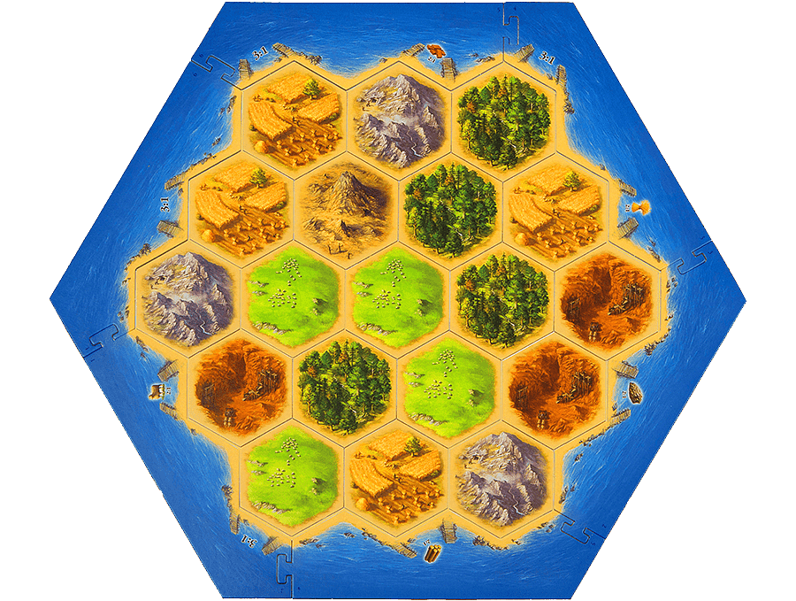
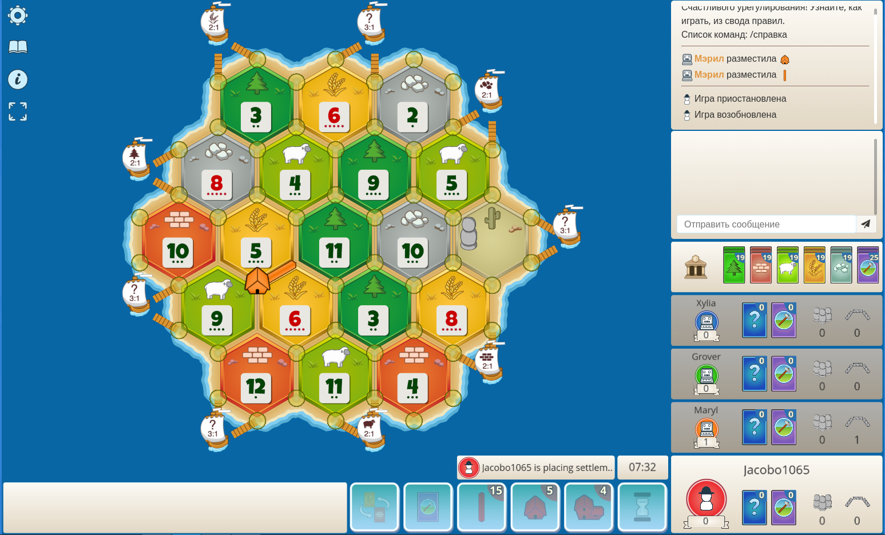

Проект: The Siedlers Of Catan

Кратко:

создание настольной игры - бестселлера "Колонизаторы" с возможностью модификации игровых правил и режимов

Описание: 

Игровая логика и короткие правила игры:

Игра происходит на гексогональной карте, состоящей из 4 - х ключевых объектов:

1) Шестиугольники - области с ресурсами, которые можно получать в процессе игры
2) Вершины - шестиугольников - места под создание строений (lvl 1 - поселение, lvl 2 - город): объекты - добытчики ресурсов.
Ресурсы добываются со всех соседних шестиугольников
3) Ребра шестиугольников - метса под дороги, Дорога - объект для связи вершин, строить можно только в достижимых вершинах
4) Край карты (океан) - неигравая территория + порты (при соседстве с которыми появляются доп. возможности торговли с банком)

Цель - набрать 10 победных очков, получаемых за постройку строений и выполнение достижений

Игроки делают ходы поочереди, "бросая кубики", которые показывают приносящие на этом ходу ресурсы шестиугольники

После броска они могут строить и торговаться (бартер друг с другом)

Подробные правила [здесь](https://www.catan.com/)

Технические особенности:

1) Игра будет осуществляться по сети (глобальной и локальной) будет реализовано две программы - отвечающие за работу 
глобального сервера и работу приложений пользователей
2) Пользовательское приложение будет делиться на две глобальные части (активности): активность меню и активность
игровой сессии
3) Для реализации интерфейса предпологается реализация adapter - a путем создания собственных классов, отвечающих за 
пользовательсикй интерфейс (Button, View, TextField ... )
Реализовывать функционал которых я буду за счет использования библиотек (целевая - [Qt](https://www.qt.io/))

    P.S. К этому пункту у меня
в проуессе реализации появился вопрос и сомнение в нем, т.к. мне не особо понятна его необходимость, а усложнение работы от такого подхода достаточно значительное

Пример активности игры (концепт):
